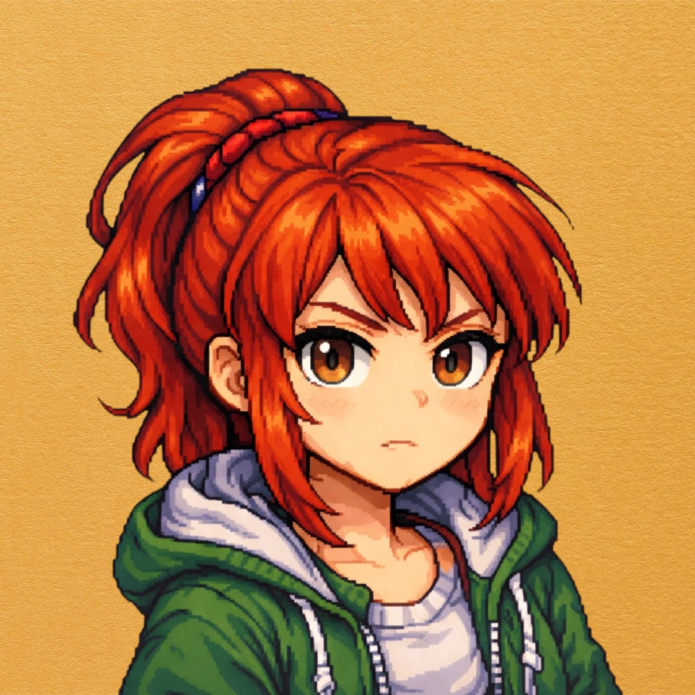
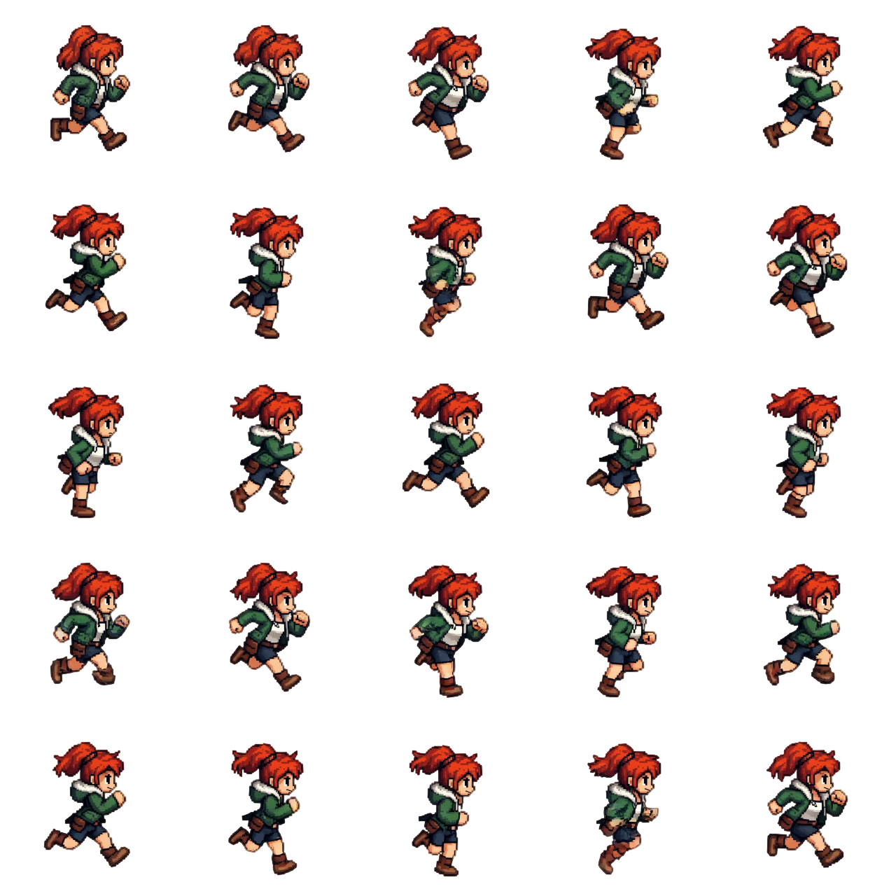
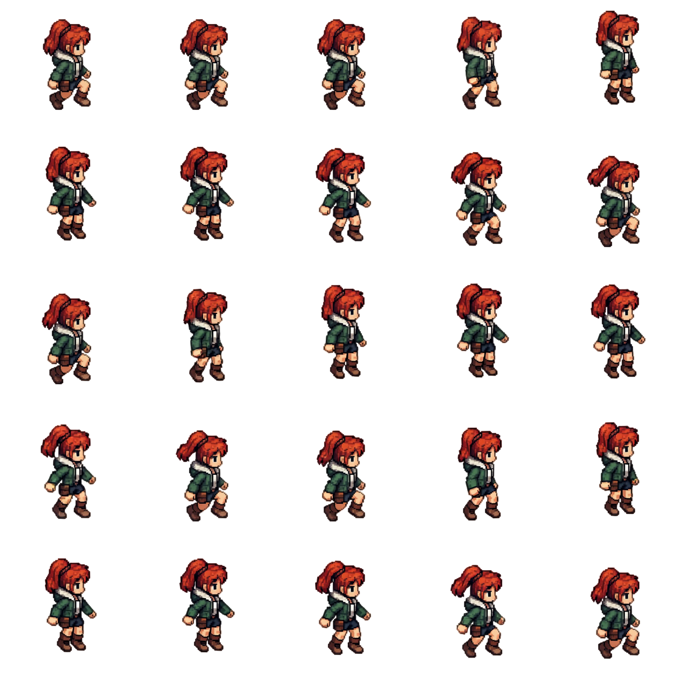
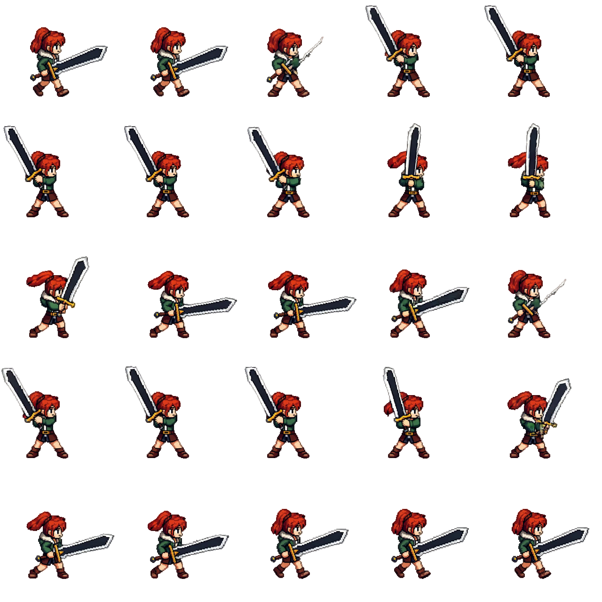
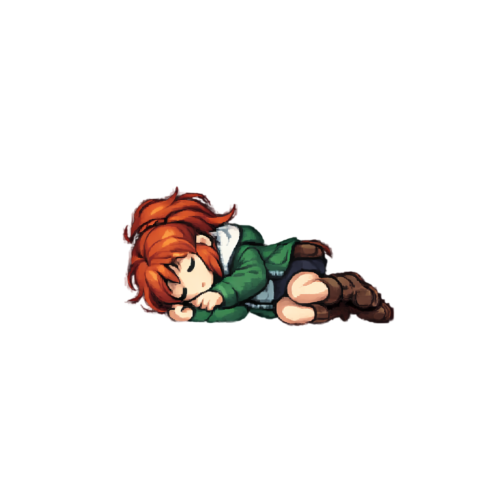

# Selene: Kindling

> *She woke up by a fountain she had never seen, in a world she almost remembered.*

A top-down 2D action RPG written in C# on [MonoGame](https://www.monogame.net/).
You play as **Selene**, a fire wielder from a noble clan, stranded in the Spirit World with no memory of how she arrived. Guided by **Wisp**, a curious spirit, she must rekindle her fire abilities, earn the trust of the spirit villagers, and uncover the source of a growing corruption.


---

<p align="center">
  
</p>

## Chapter 1: Kindling

Selene awakens in the Spirit World with no memory of how she arrived, surrounded by curious spirits who are shocked to see a human. She is guided by Wisp, the son of the village leader, who explains that survival here depends on mastering elemental combat, something her own world has long abandoned.

As she struggles to control her unstable fire abilities, Selene helps the spirit villagers with tasks and battles corrupted creatures, gradually earning the trust of the cautious village leader. Throughout this time, she uncovers signs of a growing corruption and is drawn to a sealed temple that reacts to her presence.

Once she has proven herself, the leader entrusts her with the key to enter. Inside, Selene faces a powerful guardian tied to her ancestors' past and, after defeating it, claims an ancient fire-forged blade that begins to stabilize her power, unaware that her arrival has already set greater events into motion across both worlds.

## Features

- **Cinematic intro** with typewriter dialog, sleeping Selene surrounded by watching spirits, and a Wisp encounter with animated portrait dialog boxes
- **Real-time arena combat** with WASD movement, fire attacks, melee combat, dodge mechanics, screen shake, spectator crowds, and boss HP bars
- **Fire powers** including Fireball, Fire Punch, Ember Burst, Flame Shield, and Focus
- **Melee combat** with animated sprite sheets and directional facing
- **Spirit World** spanning a 50x30 tile map with five biomes: fountain courtyard, ancient temple, western garden, eastern ruins with a practice arena, and southern grove
- **Spirit NPCs** with unique names, dialog, and proximity-based name display
- **Wisp companion** who provides a tutorial, battle commentary, and repeatable training fights
- **Portrait dialog system** inspired by Megaman Battle Network with animated talking portraits
- **Dynamic soundtrack** that transitions between intro, battle, and exploration themes
- **Camera system** with smooth follow, zoom, and screen shake

<p align="center">
  
  
  
</p>

## Controls

| Key | Action |
|-----|--------|
| `W A S D` | Move |
| `I` | Fire Punch (melee) |
| `O` | Fireball (ranged) |
| `K` | Ember Burst (ranged spread) |
| `L` | Flame Shield (defense) |
| `P` | Focus (restore MP) |
| `Hold Shift` | Slow-mo + command selector |
| `E` | Interact / talk to NPCs |
| `Space` | Advance dialog |
| `F5` | Restart from intro |
| `Esc` | Quit |

## Build & Run

Requires the [.NET 8 SDK](https://dotnet.microsoft.com/download). MonoGame content tooling is restored automatically.

```bash
dotnet tool restore
dotnet build
dotnet run
```

## Project Layout

```
SeleneKindling/
  Game1.cs                MonoGame entry point
  Globals.cs              Static singletons: SpriteBatch, Camera, time
  _Managers/
    GameManager.cs        Game state machine (Intro / Battle / Overworld)
    MusicManager.cs       Dynamic music transitions
    InputManager.cs       Input state tracking
  _Models/
    Map.cs                50x30 tile grid, decorations, collision
    Tile.cs               Drawable sprite with source rect, origin, and scale
    Player.cs             Animation state machine, movement, collision
    Camera.cs             Smooth follow with zoom and screen shake
  _Battle/
    BattleArena.cs        Real-time arena combat system
    CommandWheel.cs       Move selector UI
  _Sequences/
    IntroSequence.cs      Cinematic opening with Wisp encounter
    PortraitDialog.cs     Portrait dialog with animated talking sprites
    AmbientDialog.cs      Typewriter self-talk system
    DialogTriggers.cs     Cell-based one-shot dialog lines
    ChaliceInteraction.cs Spirit shrine interaction
    SpiritNPCs.cs         Overworld spirit characters with names
    HudOverlay.cs         UI overlay components
  Content/
    *.png                 Tilesets, character sheets, props, temple interior
    *.wav                 Music tracks (intro, battle, explore)
    *.spritefont          Dialog font
  assets/
    *.png                 Source sprite sheets and portraits
    *.m4a                 Original music files
```

<p align="center">
  
</p>

## Credits

- Code, design, and animation logic by *Ishmam Ahmed*
- Tilesets and prop atlas from *EPIC RPG World Pack ([FREE Demo] Ancient Ruins)* by Pixel Hole Games
- Character sprites are custom AI-generated and hand-tuned
- Music composed for the project

## License

Source code is released under the MIT license. Asset packs retain their original licenses.
